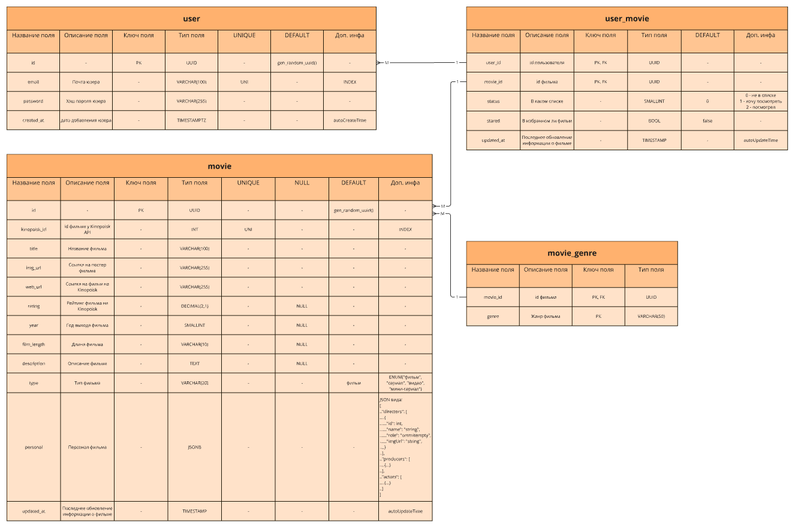

# Filmer app description

## DB schema (for Filmer v1.0.0):

## DB description

Main DB is the filmer_db on CockroachDB single-node cluster.
CockroachDB store all data about users, movies, genres and user movies.

 

As a cache, Redis is used.
Redis store blacklisted access tokens.

## App description

With Filmer API you can:
1. create account
2. search movies by keyword
3. get movies info
4. save movies to your own stared list (OR want-to-watch list OR watched list)
5. get your stared (OR watched OR want-to-watch) movies

#### 1. Create account

You can create new account. After, you can log in under created account and log out from it.

* answer is using entity.UserWithToken struct (for log in and sign up) or 204 (for logout)

#### 2. Search movies by keyword

For searching movies used official Kinopoisk API.
Answer is separated into pages of 25 movies per page.

* answer is using entity.SearchedMovies struct

#### 3. Get movies info

For getting movies used Kinopoisk API Unofficial.
If movie is in DB, you get movie info from DB.
If movie was not found in DB, you get movie info from API, and gotten info is saved to DB.

 

Also saved movie info to DB has expiration duration.
If saved movie info is expired, app runs background update task for it.

> _!! But you get outdated info first time after dtection of expiration !!_

* answer is using entity.UserMovie struct with loaded full info of entity.UserMovie.Movie substruct

#### 4. Save movies to your own stared list (OR want-to-watch list OR watched list)

You cat star and unstar any movie.
Also you can put movies to the list "want-to-watch" or "watched" or delete it from these lists.

* answer is using entity.UserMovie struct without entity.UserMovie.Movie info

#### 5. Get your stared (OR watched OR want-to-watch) movies

You can get movies from your own lists.
There is supported filter and sort results.
Answer is separated into pages of 10 movies per page.

* answer is using entity.UserMoviesWithCategory struct with list of entity.UserMovie (with filling only light fields for entity.UserMovie.Movie)
